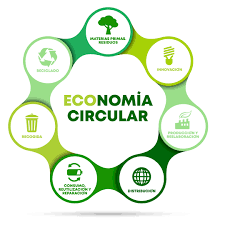
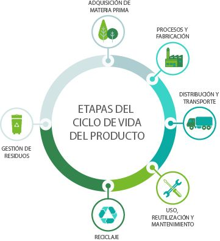

# SOSTENIBILIDAD

# DICIEMBRE
# NOVIEMBRE

### SESION 11 28112025 - Economia lineal y circular
En esta clase hemos hablado de la economia circular y como hemos avanzado como sociedad, la economia circular es una economia que se retroalimenta de modo que genera empleo para que se de un reciblaje y una sostenibilidad. Se ha comentado como ejemplo un coche al convertirlo en chatarra.

La pregunta de hoy es: ¿En qué nos afecta el ecodiseño?
Por lo que he podido ver, el ecodiseño es la metodología que se basa en reducir el impacto ambiental en todas las fases del desarrollo de un producto, diría que nos afecta a la hora de la realidad de esto, es decir, cuantas cosas se desarrollan como "eco" pero su "ecodiseño" realmente es mas costoso que un diseño normal, y hasta que punto es algo real y no una idea utópica? no me queda claro del todo si esto es algo realmente posible en la actualidad.

Imagen de hoy:

### SESION 10 21112025
En esta clase Miguel no pudo asistir, as&iacute; que no tratamos ningun tema.

### SESION 9 14112025 - El viaje oculto del producto
En esta clase hemos hablado del análisis del ciclo de vida de un producto y su peso oculto que significa que si por ejemplo un movil pesa 150g, el peso de materiales gastado para llegar a esos 150g pueden ser quizás 80kg, que serían su peso oculto. También de las 2 principales manera de obtener energía y otras alternativas. Hoy tenemos que preguntar a nuestra IA de confianza sobre los materiales implicados en una de las fases del ciclo de vida de un producto, yo elegí una PSU de ordenador y la fase de fabricación:

Prompt: para conseguir fabricar una PSU de ordenador que materiales y energias se utilizan?

Respuesta: Una PSU se fabrica usando sobre todo cobre (bobinas, cables), aluminio (disipadores y carcasa), acero, silicio (chips y semiconductores), plásticos (ventilador, conectores, aislantes) y ferrita (núcleos de transformadores e inductores). También entran materiales como estaño para soldaduras, epoxi y fibra de vidrio para la PCB, y pequeños imanes y resinas aislantes.

A nivel energético, se consume mucha electricidad en:

Minería y refinado de metales como cobre y aluminio.

Fabricación de chips, que necesita hornos, salas limpias y procesos químicos intensivos.

Producción de PCB, que implica corte, baños químicos y horneado.

Montaje: máquinas de pick-and-place, hornos de soldadura, soldadura manual y test de carga.

Logística, desde el transporte de materias primas hasta el envío de la PSU terminada.

El peso oculto está en toda esta cadena: toneladas de roca movida para obtener unos gramos de metal, energía enorme para fundir y purificar, procesos químicos que generan residuos y uso de maquinaria industrial. Aunque una PSU final pesa 1–2 kg, su “peso real” en materiales y energía es mucho mayor.

Imagen de hoy:

### SESION 8 07112025
En esta clase Miguel no pudo asistir, as&iacute; que no tratamos ningun tema.

# NOVIEMBRE
# OCTUBRE

### SESION 7 31102025
En esta clase hemos estado hablando sobre la sostenibilidad del agua y las "3 facetas en las que dividir el mundo", ambiental, social y econ&oacute;mica, Tambi&eacute;n se nos ha asignado una tarea para el trabajo grupal, que va de qeu cada uno ponga en el proyecto una medida de sostenibilidad.

### SESION 6 24102025
En esta clase hemos hablado de las pautas sobre el proyecto grupal del m&oacute;dulo y de la clasificaci&oacute;n de los seres vivos en estrategia K y estrategia R de reproducci&oacute;n. La pregunta de hoy es: ¿Qu&eacute; estrategia llevamos los humanos? Yo dir&iacute;a que hemos ido cambiando, antes era m&aacute;s com&uacute;n la estrategia R y ahora es m&aacute;s com&uacute;n la K, tambi&eacute;n depende de las culturas, pero generalmente y comparado con otras especies, es K.

### SESION 5 17102025
En esta clase hemos hablado de si vivimos solos o no, de como nos relacionamos con los dem&aacute;s seres vivos del planeta y como vivimos en sociedad, la naturaleza y las reflexiones a la hora de sobrevivir. La pregunta de hoy es: ¿Qu&eacute; hacemos nosotros: coopearmos o competimos? Yo dir&iacute;a que depende mucho de a que nos refiramos, ya que en funci&oacute;n del contexto las personas podemos cooperar o competir, es una pregunta muy ambigua.

### SESION 4 10102025
No pude asistir este d&iacute;a, pero mis compañeros me han comentado que estuvieron tratando de los l&iacute;mites de carga de los ecosistema, es decir de la capacidad m&aacute;xima de individuos que caben en los ecosistemas. La pregunta es: ¿Hay un l&iacute;mite para la poblaci&oacute;n humana? Bajo mi punto de vista s&iacute;, es decir, muchos recursos del planeta no son infinitos, y esto puede hacer que una sobrepoblaci&oacute;n sea un problema en el planeta.

# OCTUBRE
# SEPTIEMBRE

### SESION 1 19092025
En esta primera clase Miguel nos di&oacute; una introducci&oacute;n sobre la tarea, explicandonos como funcionaba. Mis espectativas son altas ya que a diferencia de lo que podr&iacute;a ser (una imposici&oacute;n de ideas y ya) parece que lo vamos a tomar de forma mas libre a modo de debate.

### SESION 2 26092025
Hoy hemos tratado un poco el concepto de sostenibilidad y que significa. Bajo mi punto de vista todavía no hemos llegado a nada como para tener una opinión demasiado clara, simplemente hemos visto un poco las definiciones. Por el momento son entendibles.

### SESION 3 03102025
Hoy hemos hablado sobre si los humanos somos o no animales, hemos visto la similitud que tenemos con ellos y hemos estado un rato tratando sobre el proyecto en grupo, creando el repositorio y hablando con nuestro grupo para saber sobre que lo haremos, la pregunta de hoy es: ¿Acabaremos con la vida en nuestro planeta? Mi respuesta es que probablemente sí, pero no estaré vivo para comprobarlo.